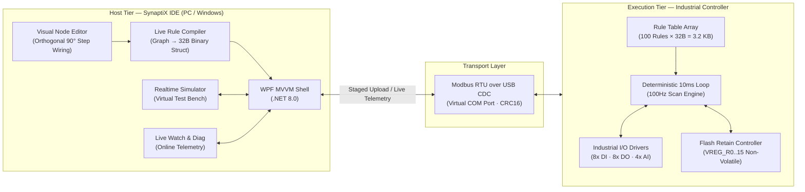

# SynaptiX IDE — Industrial PLC Programming & Automation Environment

[-006487?logo=dotnet)](https://dotnet.microsoft.com/)

> **Visual node-graph PLC programming IDE paired with an ultra-lightweight 32-byte binary rule engine running bare-metal on deterministic industrial microcontrollers with a 10ms (100Hz) scan cycle.**

**SynaptiX IDE** re-engineers small-scale machine automation, edge computing, and Industrial IoT (IIoT) control. Rather than relying on heavy, resource-intensive virtual machines, SynaptiX IDE compiles visual control logic directly into **compact 32-byte fixed-size binary records**. The industrial controller runtime executes these records via direct pointer indexing inside a deterministic **10ms (100Hz) scan loop**, fitting up to 100 industrial automation rules into just **3.2 KB of RAM**.

---

## 📥 Downloads & Installation

SynaptiX IDE is distributed as a **Standalone Single-File Executable (no installer or external runtime required)**:

| Edition | Architecture | Download File | Notes |
| :---: | :---: | :---: | :--- |
| **v1.3.1 (Latest)** | Windows x64 (.exe) | [**Download `SimplePLC.Studio.exe`**](https://github.com/hoanv-synaptix/SynaptiX-IDE-Releases/releases/latest/download/SimplePLC.Studio.exe) | Portable single-file executable for Windows 10/11 |
| **All Releases** | GitHub Releases | [**Browse Release History**](https://github.com/hoanv-synaptix/SynaptiX-IDE-Releases/releases) | Full changelog, release notes, and assets |

### System Requirements:
- **Operating System:** Windows 10 or Windows 11 (64-bit).
- **Interface:** Physical USB port or USB-to-RS485 adapter (connects to SynaptiX Controller via USB CDC / Modbus RTU).
- **RAM:** Minimum 512 MB available memory.

---

## 1. Key Capabilities & Features

### 🖥️ SynaptiX IDE (Desktop Client / .NET 8 WPF)
- **Visual Node-Graph Programming:** Design industrial control logic across a 4-stage pipeline (`Input Tag` ➔ `Trigger` ➔ `Guard` ➔ `Action`). Features orthogonal 90° right-angled step wiring (`StepConnection`) and perfectly straight horizontal ladder rungs for aligned nodes.
- **Live Rule Compiler (Real-Time AST):** Continuously analyzes the graph topology and generates valid 32-byte binary records in memory in real time without requiring manual compile passes.
- **Unified 128-Tag Architecture:** Configure and monitor 8x 24VDC Optocoupled Digital Inputs (DI), 8x 24VDC Relay Outputs (DO), 4x 12-bit Analog Inputs (AI: 4–20mA / 0–10V), 16x Virtual Bit Flags (VFLAG), 16x RAM Registers (VREG), and 16x Non-Volatile Retain Registers (VREG_RETAIN).
- **Dual-View Rule Table:** Inspect human-readable engineering narratives (*"When DI0 rising edge AND DI1 = 1 THEN Set DO0"*) side-by-side with compiled 32-byte raw hexadecimal machine code.
- **10 Industrial Automation Blueprints:** 1-Click instant generation of real-world factory logic: Andon OEE Downtime Alarm, High-Speed Production Counter (Retain Flash), E-Stop Safety Circuit, Motor Thermal Overheat Guard, Safety Door Interlock, Pneumatic Pressure Monitor, Sump Pump Control, Periodic Lubrication Timer, 3-Color Tower Light, and Material Feeder Call.
- **Two-Phase Staged Deployment:** Safe download mechanism utilizing a Staging Buffer, independent CRC-16 integrity verification, and atomic activation via an Atomic-Commit command (`0xA5A5`), meeting safety standard **SPLC-AF-003**.
- **Integrated Real-Time Simulator:** Test and debug logic offline with virtual DI toggle switches, AI analog sliders, DO output status LEDs, and a real-time event trace log without physical hardware.
- **Live Watch & Online Diagnostics:** Real-time variable inspection with quality badges (Good / Stale / Bad), live sparkline telemetry graphs, and instant tag override / force write.
- **Built-in Auto-Updater:** Automatically checks for new versions on GitHub Releases, previews markdown changelogs, and performs zero-hassle hot-swap restart upon update.
- **Industrial Design System:** High-contrast technical interface adhering to Siemens TIA Portal and Beckhoff TwinCAT ergonomics (Siemens Petrol `#006487`, IEC Green `#107C41`, sharp 2px technical border radii, zero drop-shadow clutter), with instant runtime language switching (English / Vietnamese).

### ⚡ Industrial Controller Rule Engine (Firmware)
- **Deterministic 10ms Scan Cycle (100Hz Loop):** Predictable fixed-time execution: sample inputs ➔ evaluate 100-rule array ➔ update physical outputs with sub-millisecond overhead.
- **Power-Loss Retain Protection:** Production totals, shift counters, and recipes persist across power cuts in internal microcontroller Flash with wear-leveling (>100,000 cycles).
- **Hardware Dwell Filter:** Configurable `for_ms` parameters eliminate electrical bounce on mechanical limit switches and sensors before actuator triggering.

---

## 2. System Architecture

### The 4-Stage Signal Execution Pipeline:
$$\mathbf{Input\ Tag} \longrightarrow \mathbf{Trigger\ (Edge/Timer)} \longrightarrow \mathbf{Guard\ (Compare/Interlock)} \longrightarrow \mathbf{Action\ (Output/Register)}$$

---

## 3. The 32-Byte Binary Rule Contract (ABI)

Every visual logic rung compiles into a fixed **32-byte binary struct** (`struct SPLC_RuleRecord`, 16 Modbus registers) matching controller memory layout:

| Register Range | Byte Offset | Field Name | Data Type | Technical Description |
| :---: | :---: | :--- | :---: | :--- |
| `0..1` | `0x00..0x03` | `threshold_lo` | `int32_t` | Lower boundary / comparison setpoint (High Word first) |
| `2..3` | `0x04..0x07` | `threshold_hi` | `int32_t` | Upper boundary for BETWEEN guard condition (High Word first) |
| `4..5` | `0x08..0x0B` | `for_ms` | `uint32_t` | Dwell debounce filter duration or timer interval in milliseconds |
| `6..7` | `0x0C..0x0F` | `action_param` | `int32_t` | Action execution parameter value (High Word first) |
| `8` | `0x10..0x11` | `trigger_tag` | `uint16_t` | Input trigger tag index (`0..127`) |
| `9` | `0x12..0x13` | `action_tag` | `uint16_t` | Target tag index receiving the action (`0..127`) |
| `10` | `0x14..0x15` | `guard_tag` | `uint16_t` | Guard tag index (bit 15: NEGATE, bits 0..14: tag ID) |
| `11` | `0x16..0x17` | `enabled_trigger` | `uint16_t` | High byte: `enabled` (0/1); Low byte: `trigger_type` (0..4) |
| `12` | `0x18..0x19` | `guard_action` | `uint16_t` | High byte: `compare_op` (0..7); Low byte: `action_type` (0..7) |
| `13..15` | `0x1A..0x1F` | `reserved[3]` | `uint16_t[3]` | Reserved alignment registers (Sender writes `0x0000`) |

---

## 4. Unified 128-Tag Memory Map

| Tag Range | Identifier | Data Type | Physical Layer & Retention | Industrial Application |
| :---: | :---: | :--- | :---: | :--- |
| **`0`** | `NONE` | — | Null Reference | Unconnected pins or bypassed guards |
| **`1 .. 8`** | `DI0 .. DI7` | 1-bit | 24VDC Optocoupled Inputs | Proximity sensors, E-Stop buttons, limit switches |
| **`9 .. 16`** | `DO0 .. DO7` | 1-bit | 24VDC Relay Outputs | Contactor coils, pneumatic solenoid valves, sirens |
| **`17 .. 20`** | `AI0 .. AI3` | 12-bit | 4–20mA / 0–10V ADC | Pipeline pressure transmitters, temperature RTD probes |
| **`21 .. 36`** | `VFLAG0..15` | 1-bit | Volatile RAM (Cleared on reset) | Internal logic flags (`in_shift`, `auto_mode`, `interlock`) |
| **`37 .. 52`** | `VREG0..15` | 16-bit | Volatile RAM (Cleared on reset) | Mathematical variables, temporary timers, scratch registers |
| **`53 .. 68`** | `VREG_R0..15` | 16-bit | **Non-Volatile Internal Flash** | **Persistent**: Production count, cycle logs, batch recipes |

---

## 5. Quick Start Guide

1. **Connect Hardware:**
   - Plug the controller into your PC via USB (or configure virtual COM loopback).
   - Launch `SimplePLC.Studio.exe`.
   - Select your COM port on the top bar and click **Connect** (or select `SIMULATOR (VIRTUAL)` for instant offline testing).
2. **Design Control Logic:**
   - Drag nodes from the left palette onto the canvas (`Input Tag` ➔ `Trigger` ➔ `Guard` ➔ `Action`).
   - Wire node pins together (wires snap to orthogonal 90° routes automatically).
   - Or click the **Blueprints** tab and instantiate pre-built industrial circuits in 1 click.
3. **Simulate & Deploy:**
   - Switch to the **Simulator** tab to verify ladder logic against simulated I/O.
   - Click **Save & Compile** to validate the 32-byte binary rule table.
   - Switch to the **Deploy** tab and click **Start Deploy** to upload and atomically activate logic on the controller.
4. **Online Telemetry & Updates:**
   - Monitor real-time variables in the **Live Watch** tab.
   - Check for software updates anytime via **`Help -> Check for Updates...`** or **`Help -> SynaptiX IDE Technical Specifications & Docs...`**.

---

## 6. License & Copyright

Copyright © 2026 **SynaptiX Company**. All rights reserved.  
Engineered for the SynaptiX Industrial Automation Ecosystem.