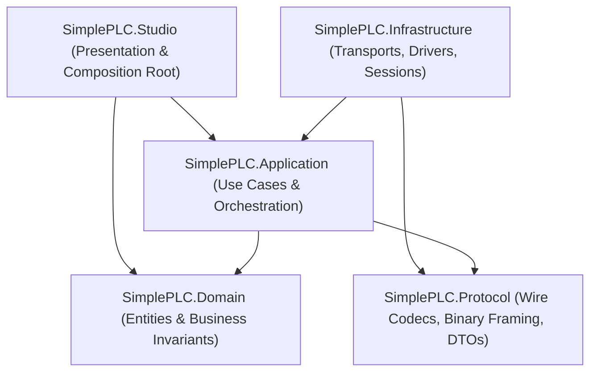
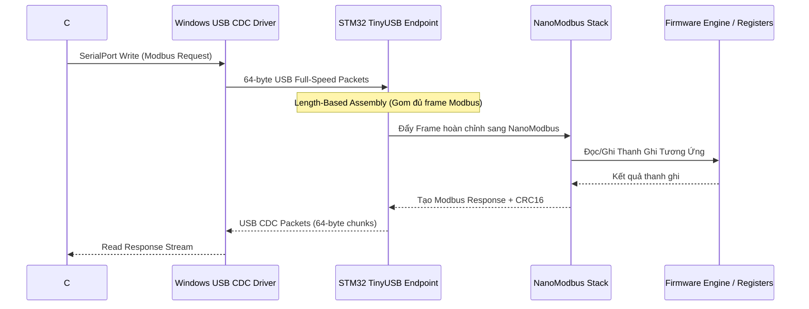
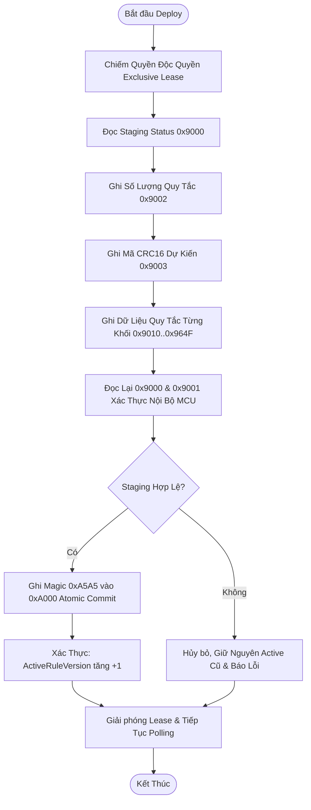
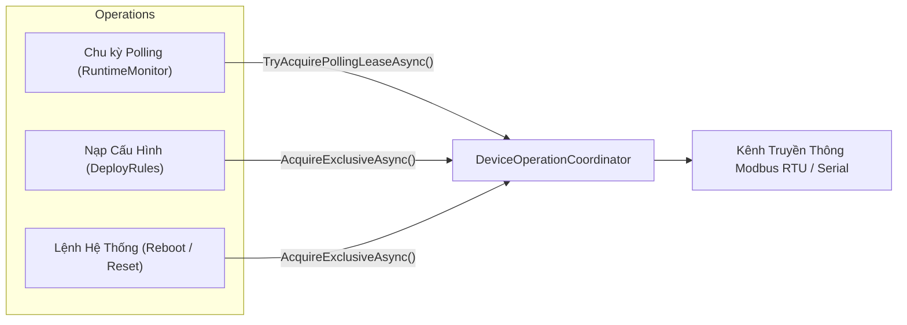
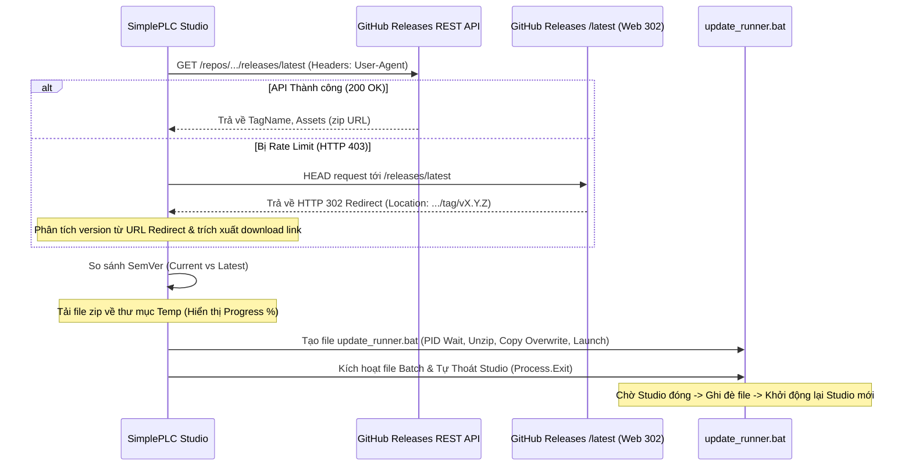
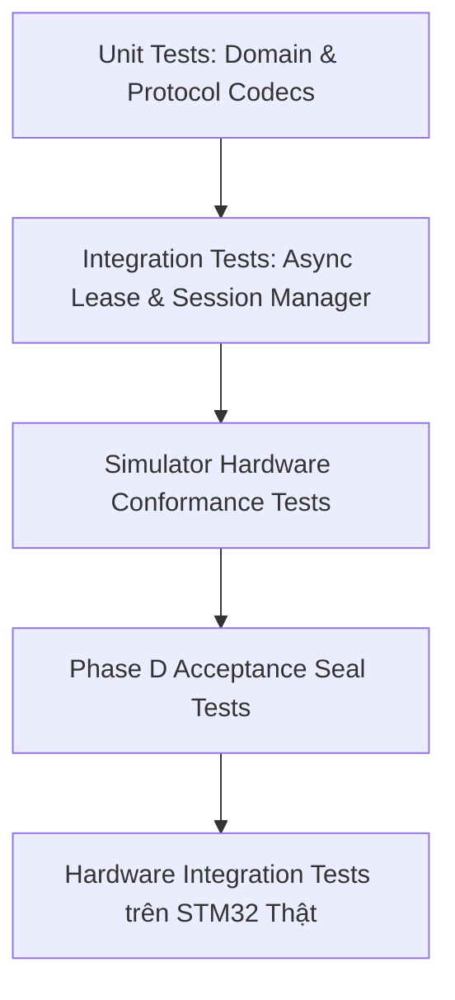

# Tài Liệu Kiến Trúc Kỹ Thuật Toàn Diện SimplePLC (Contract Platform V2.0)

> **Trạng thái**:
> - **Kiến trúc phần mềm (Software Architecture)**: Hoàn thiện & Khóa thiết kế (Production Frozen Candidate - Platform V2.0)
> - **Tiêu chuẩn Khế ước (Wire Contract)**: Data Contract Platform V2.0 (Self-Describing Descriptors 0x0000..0x0029, Wire Profile V2, Dedicated Function Blocks 0x0B00..0x0B7F, Diagnostic Control Block 0x0A20, RTC Clock 0x0810, 32-byte Rule Record, CRC-16/MODBUS, Staging Atomic Commit)
> - **Tích hợp phần cứng (Hardware Integration)**: Bộ giả lập `McuReferenceSimulator` và `HardwareTest` đạt chuẩn 100% byte-exact; Đã kiểm thử tích hợp 14 ca test theo [HARDWARE_INTEGRATION_TEST_PLAN.md](file:///g:/HoaNV/Projects/SimplePLC/docs/testing/HARDWARE_INTEGRATION_TEST_PLAN.md)
> - **Mục tiêu**: Nền tảng điều khiển, cấu hình và giám sát thiết bị công nghiệp (Remote I/O, Gateway, Controller), giao tiếp trực tiếp qua vi điều khiển STM32 Native USB CDC (TinyUSB) chạy giao thức Modbus RTU tốc độ cao.

---

## 1. Triết Lý Thiết Kế & Clean Architecture Phân Tầng

Ứng dụng SimplePLC tuân thủ chặt chẽ **Clean Architecture** và nguyên lý **Dependency Inversion Principle (DIP)**. Không có sự phụ thuộc ngược chiều hay rò rỉ chi tiết tầng thấp (Modbus, SerialPort, Win32) lên nghiệp vụ (Domain) hay giao diện (Presentation).



### 1.1. Bốn Nguyên Lý Kiến Trúc Bất Biến:
1. **Contract-First**: Ứng dụng Desktop và Firmware MCU chỉ liên kết với nhau thông qua *Data Contract* và *Modbus Register Map* chuẩn hóa. C# không phụ thuộc vào cách MCU tổ chức task RTOS, bộ nhớ RAM nội bộ hay kiến trúc chip bên trong.
2. **One-Way Dependency**: Tầng ngoài phụ thuộc vào abstraction của tầng trong. Tầng `Domain` không có bất kỳ external reference nào; tầng `Application` định nghĩa các interface mà mình cần (`IDeviceSession`, `IRuleTableGateway`, `IDeviceHealthReader`,...) và tầng `Infrastructure` chịu trách nhiệm hiện thực các interface đó.
3. **Transport-Agnostic Domain**: Nghiệp vụ (Rules, Tags, Logic Validation) hoàn toàn không biết đến khái niệm Modbus, USB COM port, hay địa chỉ thanh ghi hexa.
4. **UI Never Talks Modbus Directly**: Tầng giao diện WPF chỉ tương tác thông qua `UseCases`, `Services` và `IRuntimeStateStore` do tầng `Application` cung cấp.

---

## 2. Bản Đồ Cấu Trúc Mã Nguồn (Directory Layout & Project Ownership)

```text
SimplePLC.sln
│
├── src/
│   ├── SimplePLC.Domain/              # Lõi nghiệp vụ (Domain Entities, Value Objects, Validators)
│   ├── SimplePLC.Protocol/            # Khế ước truyền thông (Modbus Register Map, Binary Codecs, C Headers)
│   ├── SimplePLC.Application/         # Tầng điều phối (Use Cases, State Stores, Session Manager, Coordinator)
│   └── SimplePLC.Infrastructure/      # Tầng hạ tầng (Serial USB-CDC Transport, Modbus RTU, Simulator)
│
├── SimplePLC.Studio/                  # Giao diện người dùng Desktop (WPF, MVVM, Nodify Canvas, Design System)
│   ├── Converters/                    # XAML Value Converters (Color, Visibility, State)
│   ├── Models/                        # UI Presentation Models (TagModel, RuleModel, NodeModel)
│   ├── Services/                      # Studio Services (AppServices, LocalizationService, AppUpdateService)
│   ├── Styles/                        # Design Tokens & Implicit Styles (Colors.xaml, Controls.xaml, NodeTemplates.xaml)
│   ├── ViewModels/                    # MVVM ViewModels (MainVM, LogicEditorVM, RuleTableVM, LiveWatchVM, DeployVM)
│   └── Views/                         # XAML Views (MainWindow, LogicEditorView, RuleTableView, LiveWatchView)
│
├── tools/
│   └── SimplePLC.McuEmulator/         # Ứng dụng Console giả lập STM32 MCU byte-exact trên cổng Serial/COM ảo
│
└── tests/
    ├── SimplePLC.Domain.Tests/        # Kiểm thử bất biến nghiệp vụ, kiểm tra ràng buộc quy tắc
    ├── SimplePLC.Protocol.Tests/      # Kiểm thử Wire Contract V1.9, Register Codec, CRC-16, Golden Vectors
    ├── SimplePLC.Infrastructure.Tests/# Kiểm thử Transport, Frame Assembler, Simulator Register Memory
    └── SimplePLC.Application.Tests/   # Kiểm thử Use Cases, Recovery Lifecycle, RuntimeStateStore, Phase D Seal Tests
```

---

## 3. Khế Ước Giao Tiếp Phần Cứng & Bản Đồ Thanh Ghi Modbus V1.9

### 3.1. Chuỗi Truyền Dẫn Vật Lý (Native USB CDC Pipeline)
Hệ thống không sử dụng chip chuyển đổi USB-UART rời (như CH340 hay CP2102) mà sử dụng trực tiếp **Native USB Peripheral** của chip STM32 chạy qua thư viện **TinyUSB**:



* **Deterministic Length-Based Reading**: Bộ ghép khung tại `ModbusRtuClient.cs` dự đoán chính xác số byte cần nhận dựa trên Function Code và Byte Count, gom đủ các mẩu gói 64-byte của USB CDC trước khi tính toán CRC-16, triệt tiêu nguy cơ rách khung (frame fragmentation).

---

### 3.2. Bản Đồ Thanh Ghi Modbus Chuẩn Hóa (Modbus Register Map Platform V2.0)

| Dải địa chỉ | Số Reg | Tên phân vùng | Quyền | Ý nghĩa kỹ thuật |
| :--- | :--- | :--- | :--- | :--- |
| **`0x0000..0x0009`** | 10 | **Device Descriptor** | RO | Bản tin định danh (Descriptor V1): Class, Variant, HW Rev, FW Rev, ProtocolVersion=2, RuleFormatVersion=7. |
| **`0x0010`** | 1 | **Rule Table Info** | RO | Số lượng quy tắc đang hoạt động thực tế trên thiết bị (`ActiveRuleCount`). |
| **`0x0020..0x0029`** | 10 | **Device Resource Info** | RO | Bản tin tài nguyên tự mô tả: WireProfile=2, MaxRules, DI/DO/AI counts, Retain count, Total tags. |
| **`0x0100..0x073F`** | 1600 | **Active Rule Table** | RO | Bảng quy tắc đang chạy trong RAM MCU (tối đa 100 rules × 16 registers). |
| **`0x0800..0x0809`** | 10 | **Device Health** | RO | Telemetry thời gian thực: `uptime_s` (u32), `reset_reason` (u16), `health_flags` (u16), `cpu_load` (u16), `ram_usage` (u16), `scan_time_ms` (u32), `max_scan_time_ms` (u32). |
| **`0x0810..0x0813`** | 4 | **RTC Clock** | RW | Đồng hồ thời gian thực MCU: `epoch_utc_s` (u32), `tz_offset_min` (i16), `rtc_flags` (u16: SYNCED, HW_PRESENT, BATTERY_LOW). Hỗ trợ Read-Before-Write. |
| **`0x0900..0x09FF`** | 256 | **Runtime Tag Values** | RO/RW | Trạng thái 128 Tag công nghiệp (mỗi Tag chiếm 2 thanh ghi = `int32` Big-Endian). Ghi trực tiếp được bảo vệ bởi Diag Safety Interlock. |
| **`0x0A00..0x0A02`** | 3 | **System Command & Result**| RW | Điều khiển hệ thống: Ghi lệnh (`1 = REBOOT`, `2 = CLEAR_FAULTS`, `3 = FACTORY_RESET`), đọc Result và Error Code. |
| **`0x0A20..0x0A24`** | 5 | **Diagnostic Control Block**| RW | Quản lý phiên chẩn đoán V2.0: Command (`1=ENTER`, `2=EXIT`, `3=HEARTBEAT`, `4=COMMIT_RETAIN`), State, Flags (`LEASE_ACTIVE`, `RETAIN_DIRTY`), Watchdog Lease (3000ms), Error Code. |
| **`0x0B00..0x0B3F`** | 64 | **Dedicated FB Timers** | RW | 8 Dedicated Timers (TON, TOF, TP) chuyên dụng (mỗi Timer 8 registers = 16 bytes). |
| **`0x0B40..0x0B7F`** | 64 | **Dedicated FB Counters** | RW | 8 Dedicated Counters (CTU, CTD, CTUD) chuyên dụng (mỗi Counter 8 registers = 16 bytes). |
| **`0x9000..0x9005`** | 6 | **Staging Control & Info** | RW | Quản lý nạp quy tắc: Status (`0=IDLE, 1=READY, 2=COMMITTING, 3=ERROR`), Error Code, Rule Count, Expected CRC-16, Active CRC & Count. |
| **`0x9010..0x964F`** | 1600 | **Staging Buffer** | RW | Vùng nhớ đệm tạm tiếp nhận dữ liệu nạp trước khi ghi vào Flash. |
| **`0xA000`** | 1 | **Commit Command** | WO | Ghi Magic Number `0xA5A5` để MCU tiến hành Atomic Commit sang Active & Flash. |
| **`0xA001`** | 1 | **Active Rule Version**| RO | Số phiên bản cấu hình quy tắc (tự động tăng dần +1 sau mỗi lần commit thành công). |

---

### 3.3. Khế Ước Dữ Liệu Quy Tắc (32-Byte Rule Record Wire Layout)
Mỗi quy tắc được đóng gói thành 16 thanh ghi Modbus (32 bytes), tương ứng chính xác với struct C `SPLC_RuleRecord_t`:

```c
typedef struct SPLC_PACKED {
    int32_t  threshold_lo;        /* [0..1] Ngưỡng dưới / giá trị so sánh chính (Big-Endian) */
    int32_t  threshold_hi;        /* [2..3] Ngưỡng trên (dùng cho khoảng so sánh Between) */
    uint32_t for_ms;               /* [4..5] Thời gian duy trì điều kiện liên tục trước khi kích hoạt (ms) */
    int32_t  action_param;        /* [6..7] Tham số hành động (giá trị set coil, step count, target value) */
    uint16_t trigger_tag;         /* [8]    Chỉ số Tag nguồn phát sinh sự kiện (0..127) */
    uint16_t action_tag;          /* [9]    Chỉ số Tag đích nhận hành động (0..127) */
    uint16_t guard_tag;           /* [10]   Bit 0..14: Guard Tag index; Bit 15: cờ đảo logic (NEGATE) */
    uint8_t  enabled;             /* [11 High Byte] 1 = Kích hoạt, 0 = Vô hiệu */
    uint8_t  trigger_type;        /* [11 Low Byte]  Loại kích hoạt (OnChange, OnTrue, Threshold, Timer,...) */
    uint8_t  compare_op;          /* [12 High Byte] Toán tử so sánh (Equal, Greater, Less, Between,...) */
    uint8_t  action_type;         /* [12 Low Byte]  Loại hành động (SetCoil, ResetCoil, Toggle, WriteValue,...) */
    uint8_t  reserved[6];         /* [13..15] Dành cho mở rộng trong tương lai, luôn ghi 0x00 */
} SPLC_RuleRecord_t;
```

---

## 4. Các Luồng Dữ Liệu Trọng Yếu (Core System Workflows)

### 4.1. Quy Trình Nạp Quy Tắc An Toàn (Atomic Staging & Commit Pipeline)
Đảm bảo thiết bị công nghiệp không bao giờ bị rơi vào trạng thái dở dang (partial write) khi đang nạp cấu hình mới:



1. **Staging Buffer Isolation**: Dữ liệu cấu hình mới được ghi vào vùng nhớ đệm Staging (`0x9010`), quy trình điều khiển trên MCU vẫn đang thực thi bình thường trên bảng Active cũ.
2. **CRC-16 Hardware Verification**: MCU tự tính lại checksum CRC-16 của vùng nhớ đệm và so sánh với giá trị ghi tại `0x9003`.
3. **Atomic Commit**: Chỉ khi người dùng gửi Magic `0xA5A5` và CRC khớp 100%, MCU mới thực hiện hoán đổi con trỏ bộ nhớ (Pointer Swap) sang Active và nạp vào Flash không bay hơi.

---

### 4.2. Quản Lý Phiên Làm Việc & Cơ Chế Async Lease Coordinator
Nhằm giải quyết triệt để xung đột bus giữa luồng đọc giám sát định kỳ (`RuntimeMonitorService` poll 100ms) và các tác vụ ghi độc quyền (`DeployRules`, `SystemCommands`, `Reboot`), hệ thống áp dụng mẫu thiết kế **Async Lease Pattern**:



* **Zero-Lag Polling**: Khi có tác vụ độc quyền đang chạy, lệnh xin lease của Polling trả về `null` ngay lập tức, `RuntimeMonitorService` tự động bỏ qua chu kỳ mà không chờ đợi, đảm bảo UI hoàn toàn không bị đứng hình (0% giật lag).
* **Safe Expected Reboot**: Khi thực hiện lệnh Reboot, hệ thống chiếm lease độc quyền, gửi lệnh `0x0A00 = 1`, đóng dứt điểm Session hiện tại mà không chờ đọc thanh ghi phản hồi (vì chip ngắt USB tức thì), sau đó chuyển sang trạng thái `Restarting` và tự động tái kết nối an toàn.

---

### 4.3. Giám Sát Trực Tuyến & Vòng Đời Chất Lượng Dữ Liệu (`TagQuality`)
Dữ liệu đọc từ thanh ghi `0x0900..0x09FF` được cập nhật vào `RuntimeStateStore` với máy trạng thái chất lượng nghiêm ngặt:
* **`GOOD`**: Dữ liệu vừa được đọc thành công trong chu kỳ gần nhất.
* **`STALE`**: Quá hạn thời gian cho phép (mặc định 600 ms không có bản tin mới). UI tự động đổi sang sắc thái cảnh báo hổ phách nhưng **bảo tồn nguyên vẹn giá trị `LastSuccessfulUpdateAt` và `RawValue`**.
* **`UNKNOWN`**: Khi ngắt kết nối vật lý hoặc chưa khởi tạo.
* **Zero False Stale**: Khi bus bị chiếm bởi lệnh Deploy, hệ thống tự động tạm ngưng tính thời gian Stale (`PollingSuppressed = true`), ngăn chặn hiện tượng nhấp nháy giao diện.

---

### 4.4. Cơ Chế Tự Động Cập Nhật Ứng Dụng (Auto-Update Engine)
Dịch vụ [`AppUpdateService.cs`](file:///g:/HoaNV/Projects/SimplePLC/SimplePLC.Studio/Services/AppUpdateService.cs) cung cấp cơ chế kiểm tra và nâng cấp phiên bản phần mềm tự động không cần can thiệp thủ công:



* **Web 302 Redirect Fallback**: Vượt qua triệt để giới hạn Rate Limit của GitHub API (60 requests/giờ cho IP không xác thực). Đảm bảo người dùng luôn kiểm tra bản cập nhật thành công 100%.

---

## 5. Kiến Trúc Tầng Trình Diễn Studio (Presentation & MVVM)

### 5.1. Hai Chiều Đồng Bộ: Graph Canvas ⮀ Matrix Rule Table
Ứng dụng cung cấp 2 phương thức lập trình logic trực quan:
1. **Logic Editor (Nodify Graph Canvas)**: Mô hình hóa các nút bấm, cảm biến, điều kiện thời gian và đầu ra theo dạng sơ đồ khối trực quan.
2. **Rule Table (Matrix Table)**: Dạng bảng danh sách công nghiệp chuẩn hóa (tương tự bảng lệnh Instruction List / Rule Grid).
* **GraphCompiler**: Đóng vai trò cầu nối, phân tích topo các kết nối giữa các Node trên đồ thị để trích xuất ra danh sách các `RuleRecord` chuẩn, tự động phản chiếu sang Bảng Quy Tắc và ngược lại theo thời gian thực.

### 5.2. Hệ Thống Đa Ngôn Ngữ Động (Reactive Localization Engine)
Dịch vụ [`LocalizationService.cs`](file:///g:/HoaNV/Projects/SimplePLC/SimplePLC.Studio/Services/LocalizationService.cs) hỗ trợ chuyển đổi ngôn ngữ tức thời giữa Tiếng Việt và Tiếng Anh:
* **Hot-Swap Không Cần Restart**: Cung cấp Indexer `Instance["Key"]` và sự kiện `PropertyChanged`. Khi người dùng chuyển đổi ngôn ngữ, toàn bộ các View và ViewModel tự động render lại văn bản ngay lập tức.

### 5.3. Design System Công Nghiệp & Màu Sắc Chuẩn Hóa
Toàn bộ mã màu giao diện được quản lý tập trung tại [`Styles/Colors.xaml`](file:///g:/HoaNV/Projects/SimplePLC/SimplePLC.Studio/Styles/Colors.xaml) và [`Styles/Controls.xaml`](file:///g:/HoaNV/Projects/SimplePLC/SimplePLC.Studio/Styles/Controls.xaml):
* **Bảng màu Slate Gray Industrial**: Lấy cảm hứng từ các phần mềm tự động hóa hàng đầu thế giới (Siemens TIA Portal, Beckhoff TwinCAT, Codesys).
* **Chuẩn hóa Màu Chọn Dòng Toàn Cục (Selection Highlight)**:
  * Nền hàng được chọn (`IsSelected = True`): **`#E2E8F0`** (Xám kỹ thuật nhạt, êm mắt).
  * Chữ hàng được chọn: **`#0F172A`** (Slate than đậm, tương phản cao, sắc nét).
  * Hiệu ứng di chuột (`IsMouseOver = True`): **`#F1F5F9`** (Hover mượt mà).
  * Áp dụng tự động qua **Implicit Styles** cho `DataGridRow`, `DataGridCell` và `ListBoxItem` trên toàn bộ ứng dụng mà không cần cấu hình lẻ tẻ tại từng màn hình.

---

## 6. Chiến Lược Kiểm Thử & Đảm Bảo Chất Lượng (Quality Assurance)

Hệ thống được bảo vệ bởi mạng lưới kiểm thử tự động đa tầng với hơn **352 unit tests** và kiểm thử nghiệm thu khép kín:



1. **Protocol Golden Vector Tests**: So khớp đầu ra nhị phân của bộ mã hóa C# với từng byte mong muốn của struct C trên firmware vi điều khiển.
2. **Phase D Acceptance Seal Tests**:
   * `E2E_UnplugRecover_RestoresGoodState`: Mô phỏng rút cáp USB vật lý đột ngột, kiểm tra quy trình tự động hồi phục 2 tầng (Fast Recovery + Passive Wait) khi cắm lại cáp.
   * `E2E_RebootReconnect_PreservesRulesAndRuntime`: Gửi lệnh REBOOT, kiểm tra quy trình ngắt kết nối chủ động và kết nối lại với phiên làm việc hoàn toàn mới.
   * `E2E_PortMigration_ReconnectsToNewEndpoint`: Tự động nhận diện thiết bị khi đổi cắm sang cổng USB/COM khác.
3. **McuEmulator Validation**: Công cụ giả lập vi điều khiển độc lập chạy trên nền tảng .NET 8 cho phép kiểm thử toàn bộ hệ thống khép kín trước khi chuyển giao cho kỹ sư phần cứng nạp lên chip STM32 vật lý.
